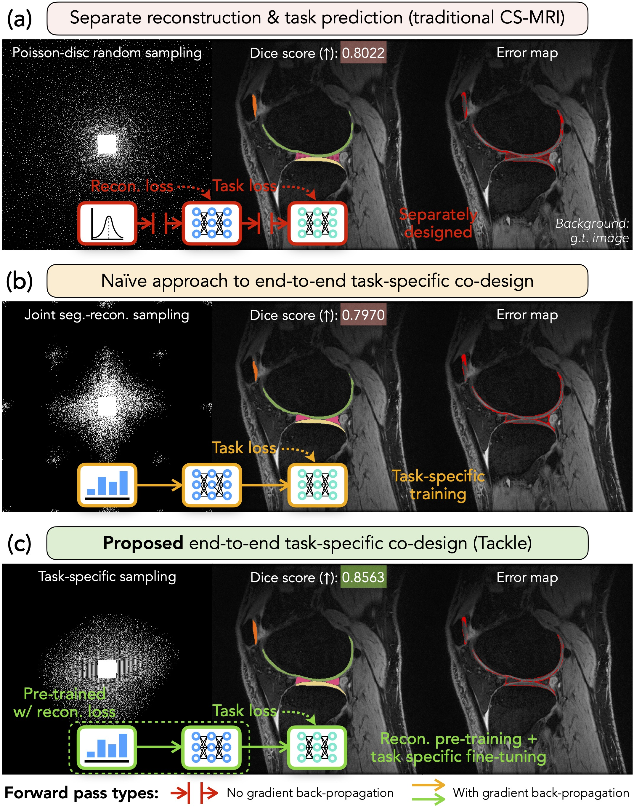

# Codebase "Learning Task-Specific Strategies for Accelerated MRI"

Paper: https://arxiv.org/abs/2304.12507

Authors: Zihui Wu, Tianwei Yin, Yu Sun, Robert Frost, Andre van der Kouwe, Adrian V. Dalca, Katherine L. Bouman

# Abstract
Compressed sensing magnetic resonance imaging (CS-MRI) seeks to recover visual information from subsampled measurements for diagnostic tasks. Traditional CS-MRI methods often separately address measurement subsampling, image reconstruction, and task prediction, resulting in a suboptimal end-to-end performance. In this work, we propose TACKLE as a unified co-design framework for jointly optimizing subsampling, reconstruction, and prediction strategies for the performance on downstream tasks. The naive approach of simply appending a task prediction module and training with a task-specific loss leads to suboptimal downstream performance. Instead, we develop a training procedure where a backbone architecture is first trained for a generic pre-training task (image reconstruction in our case), and then fine-tuned for different downstream tasks with a prediction head. Experimental results on multiple public MRI datasets show that TACKLE achieves an improved performance on various tasks over traditional CS-MRI methods. We also demonstrate that TACKLE is robust to distribution shifts by showing that it generalizes to a new dataset we experimentally collected using different acquisition setups from the training data. Without additional fine-tuning, TACKLE leads to both numerical and visual improvements compared to existing baselines. We have further implemented a learned 4x-accelerated sequence on a Siemens 3T MRI Skyra scanner. Compared to the fully-sampling scan that takes 335 seconds, our optimized sequence only takes 84 seconds, achieving a four-fold time reduction as desired, while maintaining high performance.

<p align="center">
  
</p>

# Getting started 

## 1) Clone the repository

```
git clone https://github.com/zihuiwu/tackle
cd tackle
```

## 2) Set up Conda environment

To install dependencies, run the following commands

```
conda env create -f environment.yml
```

## 3) Data preparation

We have used multiple publicly available datasets in our papers, including [fastMRI](https://fastmri.med.nyu.edu/), [Neurite OASIS Sample data](https://github.com/adalca/medical-datasets/blob/master/neurite-oasis.md) based on [OASIS](https://oasis-brains.org/), [SKM-TEA](https://aimi.stanford.edu/skm-tea-knee-mri), and [BRATS](https://www.med.upenn.edu/cbica/brats2020/data.html).

Here are some details on how we processed each dataset:
 - fastMRI: we save each slice in a separate `.npy` file that stores a dictionary with a key called `kspace` storing the k-space data of the slice. You can refer to and modify the pieces of code at the bottom of `codesign/data/fastmri_knee_singlecoil/fastmri_knee_singlecoil.py` and `codesign/data/fastmri_knee_multicoil/fastmri_knee_multicoil.py`.
 - Neurite OASIS Sample data: directly download from https://github.com/adalca/medical-datasets/blob/master/neurite-oasis.md and place the dataset at `./datasets/OASIS`.
 - SKM-TEA: Please refer to the piece of code at the bottom of `codesign/data/skmtea/skmtea.py` for processing the data. You need to modify the paths passed to the `create_infos` function. `kspace_dir` should point to `qdess/v1-release/files_recon_calib-24`. `seg_dir` should point to `qdess/v1-release/segmentation_masks/raw-data-track`. `output_dir` should be the destination where you want to save the pre-processed data.
 - BRATS: we have used the FLAIR contrast in the BRATS dataset. Please refer to the piece of code at the bottom of `codesign/data/brats/brats.py` for processing the data. You need to modify the paths passed to the `create_infos` function. `data_dir` should point to folder where BRATS dataset is stored. `output_dir` should be the destination where you want to save the pre-processed data. `selected_modality` should be set to `flair`.

## 4) Training

### Launch training
We provide the configuration files we used for training various variants of TACKLE and baselines in `./configs/`. To train a model, create a folder called `results` and simply run the following command.
```
python3 scripts/main.py -c CONFIG.yaml
```
By default, the script will automatically save checkpoints in `./results/EXP_DIR` and log all the information to [wandb](https://www.wandb.ai).

### Structure of configuration files
Here is an example configuration file (`configs/roi_reconstruction/fsc_knee_mt_roi/8x/8x_tacklenew-full_1e-2.yaml`), which trains a full-FOV reconstruction model.

```
_BASE_: ../default.yaml
exp_name: tci_fsc_knee_patho=0_8x_tacklenew-full_1e-2
lr: 0.01
model:                                                      
  name: TackleNew-Full
  sampler:
    name: LOUPESampler
    shape: [192, 192]
    subsampling_dim: [-2, -1]
    acceleration: 8
    line_constrained: False
    preselect_num: 0
    preselect_ratio: 64
  reconstructor:
    name: VarNetReconstructor
    num_cascades: 12
    chans: 18
    pools: 4
    acs_ratio: 64
    dc_weight: 1
    adj_dc_weight: True
train_loss:
  name: PSNRLoss
```
Here we highlight a few important parameters
 - `_BASE_`: the base config file that the current file will load first.
 - `exp_name`: the name of the experiment for logging (both locally and for wandb).
 - `model.sampler.name` / `model.reconstructor.name`: name of the class of the sampler / reconstructor.
 - `model.sampler.subsampling_dim`: should be `[-2, -1]` for 2D subsampling and `-1` for 1D subsampling (`model.sampler.line_constrained` should also be set `True`).
 - `model.sampler.preselect_ratio`: the ratio of the total sampling budget for the pre-select region. The default is 8 times the acceleration ratio.

To run a customized model, you can modify these parameters accordingly.

### Two-step training
In our paper, we proposed a two-step training procedure for better learning generalizable task-specific strategies. Therefore, some models require an initialization from a pretrained model (those containing "ft" in the name of the config file). In that case, you need to run the corresponding reconstruction model first. For example, before you run
```
python3 scripts/main.py -c configs/segmentation/oasis2d_seg/16x/16x_tacklenew-seg-ft_1e-3.yaml
```
you need to first run 
```
python3 scripts/main.py -c configs/segmentation/oasis2d_seg/16x/16x_tacklenew-recon_1e-2.yaml
```
You can see how a model is initialized by checking the `init_exp_dir`, `init_modules`, and `init_module_trainability` options in the configuration file. If they don't exist, the model is initialized randomly from scratch.

## 5) Testing

After the model is trained, our script will automatically test the model being trained and the results can be found locally and on wandb. If you want to test a model again for any reason, you can run the following command
```
python3 scripts/test.py -d TEST_CONFIG.yaml -c EXP_DIR/config.yaml
```
where `TEST_CONFIG.yaml` is one of the configuration files for testing in `configs/test_configs` and `EXP_DIR` is the path to the folder of the model you want to test.
The script will automatically create the dataloader according to `TEST_CONFIG.yaml` and the model according to `EXP_DIR/config.yaml`.
To sync with wandb, add an addition `--id` option with the 8-digit ID for the corresponding experiment:
```
python3 scripts/test.py -d TEST_CONFIG.yaml -c EXP_DIR/config.yaml --id xxxxxxxx
```


# Citation
If you find our work interesting, please consider citing

```
@misc{wu2023learning,
    title = {Learning Task-Specific Strategies for Accelerated MRI}, 
    author = {Zihui Wu and Tianwei Yin and Yu Sun and Robert Frost and Andre van der Kouwe and Adrian V. Dalca and Katherine L. Bouman},
    year = {2023},
    eprint = {2304.12507},
    archivePrefix = {arXiv},
    primaryClass = {eess.IV}
}
```

